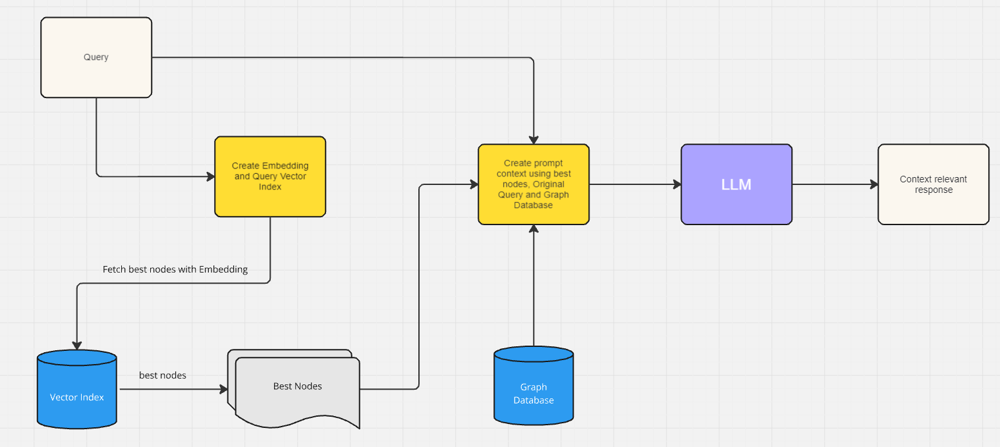
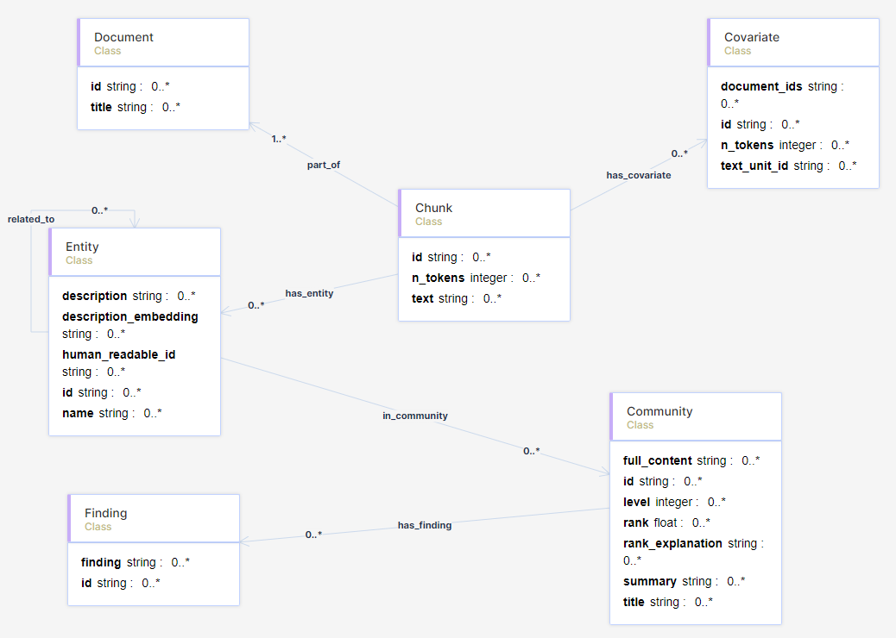

# Microsoft GraphRAG with an RDF Knowledge Graph
Code to accompany my blog posts about Microsoft GraphRAG with an RDF Knowledge Graph.

## Blog Posts

[Microsoft GraphRAG with an RDF Knowledge Graph - Part 1](https://medium.com/@ianormy/microsoft-graphrag-with-an-rdf-knowledge-graph-part-1-00a354afdb09)

Using a local LLM & Encoder to do Microsoft’s GraphRAG.

[Microsoft GraphRAG with an RDF Knowledge Graph - Part 2](https://medium.com/@ianormy/microsoft-graphrag-with-an-rdf-knowledge-graph-part-2-d8d291a39ed1)

Uploading the output from Microsoft’s GraphRAG into an RDF Store.

[Microsoft GraphRAG with an RDF Knowledge Graph - Part 3](https://medium.com/@ianormy/microsoft-graphrag-with-an-rdf-knowledge-graph-part-3-328f85d7dab2)

Using SPARQL and the Knowledge Graph for RAG.

## Data

The ontology file is in the data folder:

[msft-graphrag.owl](data/msft-graphrag.owl)

All the other data files are on my Google Drive [here](https://drive.google.com/drive/folders/1JzMiaOo3UomwPlhn0_g7j8xsnxvEHDqf?usp=sharing)